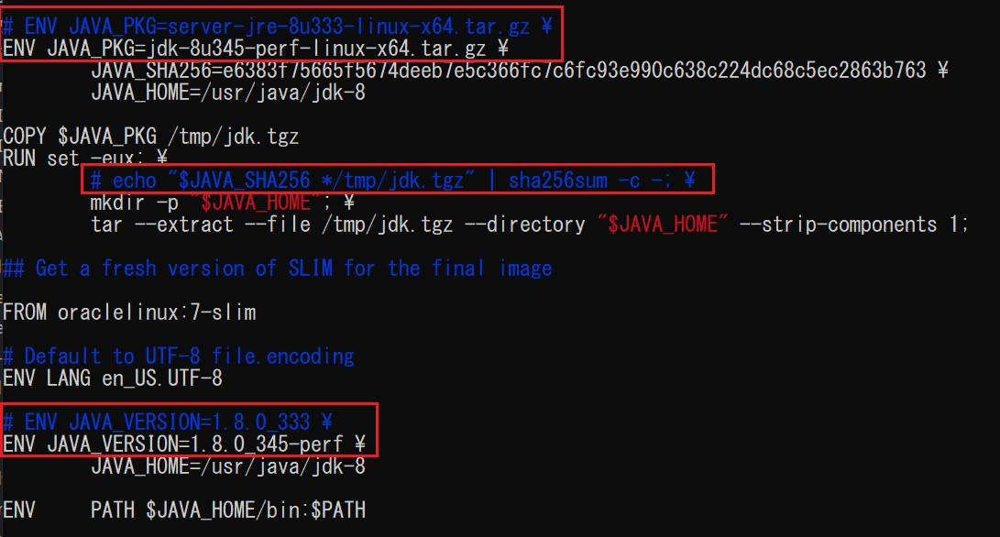

# Java-Enterprise-Performance-Pack-Demo
Performance comparison demo between Legacy Java8 and Java Enterprise Performance Pack  
## Overview  
* This demo is a fork from [Java Performance Comparison Dashboard Demo](https://github.com/swseighman/Java-Perf-Gafana) created by Scott Seighman and Kris Foster
* This demo compares throughput and latency by running sample benchmark on top of two containers, based on Java Enterprise Performance Pack and Legacy Java8 respectively

## Prerequsites
* Oracle Java 1.8.0_341
* Apache Maven 3.6.3
* Docker and docker-compose
## Demo Environment
* 8 core, 64 memories  
*   
## Contents
* **[Step1: Create docker images of java runtimes](#Step1-Create-docker-images-of-java-runtimes)**
   * [1.1 Download Java Enterprise performance pack installation binary](#11-Download-Spring-PetClinic-Sample-Application)
   * [1.2 Create Java Enterprise performance docker image](#12-Build-and-run-Spring-PetClinic-as-fat-jar)

* **[Step2: Build project](#Step2-Build-project)**
   
* **[Step3: Run the demo](#Step3-Run-the-demo)**

## Step1: Create docker images of Java SE Subscription Enterprise Performance Pack
Use Oracle Linux based Dockerfile(Offered as Open Source at Oracle) to create JDK images of Java Performance Pack.
### 1. Clone the Docker Images from Oracle
>```sh
>git clone https://github.com/oracle/docker-images
>```

>```sh
>cd docker-images/OracleJava/8
>```
### 2. Download the binary of Java Enterprise performance pack for Linux x64(Internal only)
https://jpg-data.us.oracle.com/artifactory/re-release-local/jdk/8u345-perf/6/bundles/linux-x64/jdk-8u345-perf-linux-x64.tar.gz

Put above binary under the directory of "docker-images/OracleJava/8"

### 3. Edit Dockerfile under "docker-images/OracleJava/8" to correspond with Java Performance Pacd binary
>```sh
>cd docker-images/OracleJava/8
>vi Dockerfile
>```

Change the java binary package name and java version to correspond with downloaded performance pack.

>```sh
># ENV JAVA_PKG=server-jre-8u333-linux-x64.tar.gz \
>ENV JAVA_PKG=jdk-8u345-perf-linux-x64.tar.gz \
>```

>```sh
># ENV JAVA_VERSION=1.8.0_333 \
>ENV JAVA_VERSION=1.8.0_345-perf \
>```

Also comment out the checksum part to avoid conflict while creating the docker image
>```sh
># echo "$JAVA_SHA256 */tmp/jdk.tgz" | sha256sum -c -; \
>```



### 4. Create Docker images based on Java Enterprise Performance Pac
>```sh
>cd docker-images/OracleJava/8
>docker build --file Dockerfile --tag oracle/jdkperf:8 .
>```

Confirm the docker image has been successfully created.

>```sh
>$ docker images
>REPOSITORY          TAG             IMAGE ID            CREATED             SIZE
>oracle/jdkperf      8               c97866da0082        4 weeks ago         316MB
>```

## Step2: Build project
Build the project and containers.
### 1. Clone the repository
```sh
git clone https://github.com/junsuzu/Enterprise-Performance-Pack.git
```

### 2. Run build.sh to build the project and containers
```sh
cd Enterprise-Performance-Pack/demo
./build.sh
```
When build script executed successfully, there are docker images created as below: 

```
[opc@eppdemo demo]$ docker images
REPOSITORY                                     TAG                 IMAGE ID            CREATED              SIZE
localhost/primes                               oraclejdkperf       1cda52d0f598        About a minute ago   336MB
localhost/primes                               oraclejdk8          7d9b022c5b09        About a minute ago   336MB
oracle/jdkperf                                 8                   9b4780818b52        2 hours ago          316MB
<none>                                         <none>              2f2e3d10cdff        2 hours ago          363MB
oraclelinux                                    7-slim              6a34bf539669        11 days ago          133MB
container-registry.oracle.com/java/serverjre   latest              ecd4aec3df76        6 weeks ago          316MB
```


## Step3: Build two Docker containers based on Java Performance Pack and Legacy Java8
Use Oracle Linux based Dockerfile(Offered as Open Source at Oracle) to create JDK images of Java Performance Pack.
### 1. Clone the Docker Images from Oracle